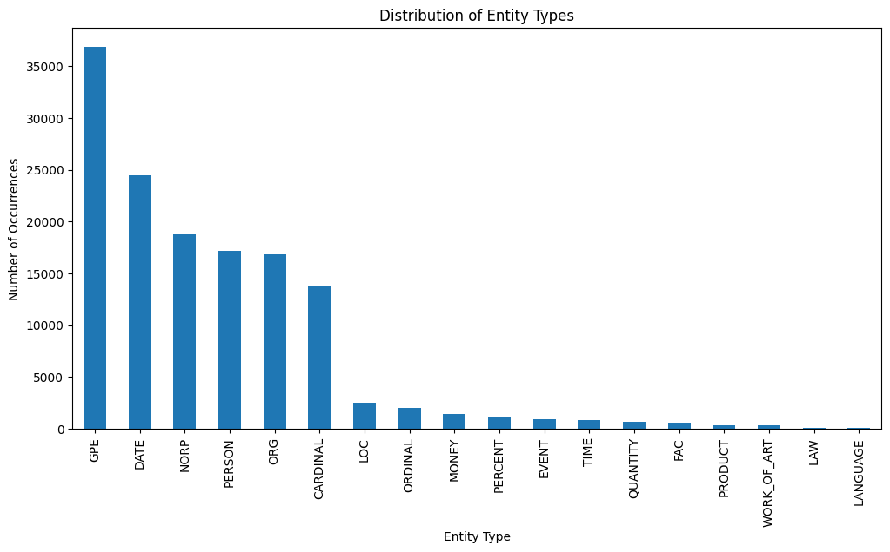
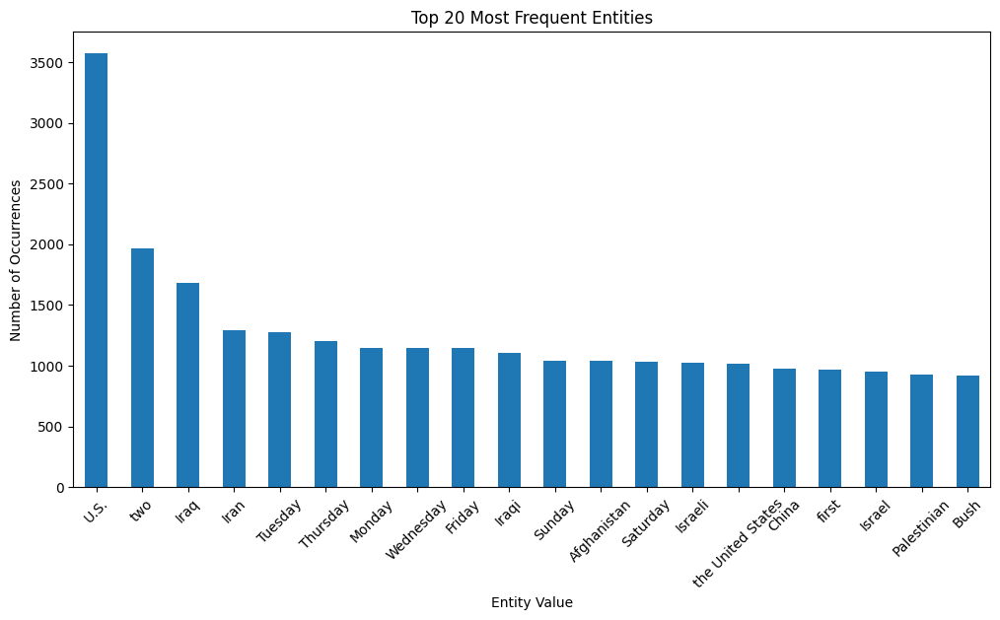

# Named Entity Recognition (NER) Project using spaCy

## Overview

Named Entity Recognition (NER) is a pivotal task in the domain of information extraction, classifying named entities into predefined categories. This project harnesses the capabilities of the spaCy library to perform NER on a specific dataset and subsequently analyzes and visualizes the distribution of various entity types.

## Introduction to spaCy

spaCy is a cutting-edge open-source software library for advanced Natural Language Processing (NLP). Designed with the intent of large-scale information extraction, it's known for its speed and efficiency.

### Why spaCy?

- **Performance**: Trained on the OntoNotes 5 corpus, spaCy's named entity recognition is amongst the best in class.
- **User-friendly**: spaCy abstracts away most of the intricate details of NLP, offering a very intuitive interface.
- **Integration**: It pairs well with other deep learning libraries like TensorFlow and PyTorch.

## Project Insights

### Entity Recognition Analysis

From our dataset, a significant portion of recognized entities pertained to geopolitical entities (GPE) with 36,865 instances, likely indicating the dataset's content being heavily oriented around global events or news. Dates and timeframes, with 24,474 instances, also played a considerable role, underscoring the temporal nature of the events described. Entities related to nationalities, religious, or political groups (NORP) appeared 18,743 times, hinting at discussions involving diverse groups and possibly global politics.

On the individual entity front:

- The term **"U.S."** being recognized 3,571 times might suggest a strong focus on events or policies related to the United States.
- Words like **"Iraq"** and **"Iran"** further emphasize geopolitical contexts, with respective mentions of 1,685 and 1,295 times.
- Recurring mentions of specific weekdays, like **"Tuesday"** (1,277 times), hint at possibly significant events on these days or a dataset sourced from periodic publications.

### Visualization

1. **Entity Type Distribution**:

    A clear visual representation of how different entity types are distributed across the dataset.

    

2. **Frequent Word Visualization**:

    Highlights the words/entities that are frequently mentioned, aiding in understanding the dataset's thematic focus.

    

## Execution Guide

Ensure Docker is set up:

1. Build:
```console
foo@bar:~$ docker build -t ner_project .
```
2. Run:
```console
foo@bar:~$ docker run -p 8888:8888 ner_project
```
3. Navigate to the provided Jupyter Notebook URL.

If you want you can use docker compose:
1. Build :
```console
foo@bar:~$ docker-compose build
```
2. Run:
```cosole
foo@bar:~$ docker-compose up
```
3. Navigate to the provided Jupyter Notebook URL.

## Conclusion

This project, powered by spaCy, not only identifies named entities but also provides significant insights into the nature and thematic concentration of the dataset. Such insights can be pivotal for downstream tasks like content recommendation, targeted advertising, or advanced data analytics.

---
